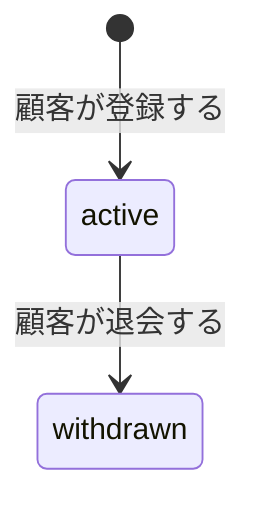
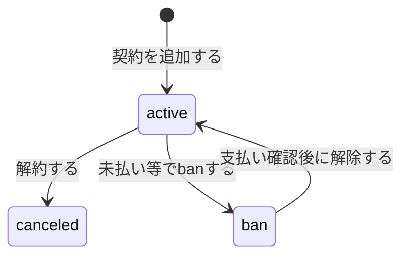

# Customer 集約

## 概要

豆図書の顧客を表す集約。
Shopifyの顧客と1対1で紐づき、顧客が持つサブスクリプション契約のライフサイクルを管理する。

個人情報（氏名・住所・クレジットカード情報など）はShopify側で管理し、本システムでは保持しない。

## ライフサイクル

- **登録**: 顧客がShopifyでサブスクリプション契約したときにShopify連携で登録される
- **更新**: プラン変更、解約、ban/unban、退会など。退会時は全契約がcanceledになる

## Customer

### プロパティ

| プロパティ | 型 | 説明 |
|-----------|---|------|
| id | CustomerId | 顧客ID |
| shopifyCustomerId | ShopifyCustomerId | Shopifyの顧客ID。システム内で一意 |
| status | CustomerStatus | 顧客ステータス（active / withdrawn） |
| subscriptions | List\<CustomerSubscription\> | サブスクリプション契約一覧 |

### メソッド

| メソッド | 説明 |
|---------|------|
| addSubscription(subscriptionPlanId, contractedFrom) | 契約を追加する |
| withdraw() | 退会する。statusをwithdrawnに変更し、全契約をcanceledにする |

### 不変条件

- ShopifyCustomerIdはシステム内で一意でなければならない
- 退会済み（withdrawn）の顧客に新しい契約を追加できない
- 退会は不可逆。再登録する場合は新しいCustomerとして作成される

### 状態遷移（CustomerStatus）

## CustomerSubscription（エンティティ）

### プロパティ

| プロパティ | 型 | 説明 |
|-----------|---|------|
| id | CustomerSubscriptionId | 契約ID |
| subscriptionPlanId | SubscriptionPlanId | 契約しているプランのID |
| status | SubscriptionStatus | 契約ステータス（active / canceled / ban） |
| contractPeriod | ContractPeriod | 契約期間 |

### メソッド

| メソッド | 説明 |
|---------|------|
| cancel(contractedTo) | 解約する。statusをcanceledに変更し、契約終了日を設定する |
| ban() | 未払い等の理由で管理者が利用を停止する |
| unban() | 支払い確認後、管理者がbanを解除しactiveに戻す |

### 不変条件

- canceledになった契約は変更できない
- 同一プランのactive契約を複数持つことはできない
- 契約開始日（from）は必須
- 契約終了日（to）は解約時にのみ設定される
- 契約終了日は契約開始日より後でなければならない

### 状態遷移（SubscriptionStatus）

## ContractPeriod（値オブジェクト）

### プロパティ

| プロパティ | 型 | 説明 |
|-----------|---|------|
| from | LocalDate | 契約開始日。引き落とし完了日 |
| to | LocalDate? | 契約終了日。解約時に設定される |

## 関連する集約

| 集約 | 関連 | 説明 |
|------|------|------|
| [Plan](./plan.md) | ID参照 | CustomerSubscriptionが契約しているプラン |
| [MonthlySubscriptionDetail](./monthlySubscriptionDetail.md) | 被参照 | 月次の配送内容がCustomerSubscriptionを参照する |
