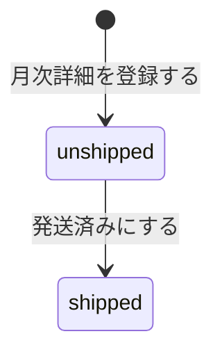

# MonthlySubscriptionDetail 集約

## 概要

契約者への月次の配送内容を表す集約。
顧客の珈琲豆の選択（おまかせ / 自己選択）と、実際に発送する珈琲豆、発送ステータスを管理する。

## ライフサイクル

- **登録**: 毎月の契約更新時に自動生成される
- **更新**: 顧客の珈琲豆選択、管理者による発送豆の確定、発送済みへの変更

## MonthlySubscriptionDetail

### プロパティ

| プロパティ | 型 | 説明 |
|-----------|---|------|
| id | MonthlySubscriptionDetailId | 月次詳細ID |
| customerSubscriptionId | CustomerSubscriptionId | 対象の契約ID |
| month | LocalDate | 対象年月 |
| selectedType | SelectedType | 選択方式（omakase / selfSelect） |
| status | ShippingStatus | 発送ステータス（unshipped / shipped） |
| choices | List\<CoffeeBeanId\> | 顧客が選んだ珈琲豆のIDリスト |
| shippingBeans | List\<CoffeeBeanId\> | 実際に発送する珈琲豆のIDリスト |

### メソッド

| メソッド | 説明 |
|---------|------|
| selectBeans(coffeeBeanIds) | 顧客が珈琲豆を自己選択する。selectedTypeをselfSelectに設定する |
| confirmShippingBeans(coffeeBeanIds) | 管理者が発送する珈琲豆を確定する |
| ship() | 発送済みにする。statusをshippedに変更する |

### 不変条件

- 同一契約・同一月の組み合わせは一意でなければならない
- shippedになった月次詳細は変更できない
- 発送する珈琲豆の数がプランのbeanQuantityに満たない状態でshippedにはできない
- 顧客の珈琲豆選択はunshippedの状態でのみ可能
- 発送する珈琲豆の数はプランのbeanQuantityと一致しなければならない

### 状態遷移（ShippingStatus）

## 関連する集約

| 集約 | 関連 | 説明 |
|------|------|------|
| [Customer](./customer.md) | ID参照 | 対象の契約（CustomerSubscription） |
| [CoffeeBean](./coffeeBean.md) | ID参照 | 選択・発送される珈琲豆 |
