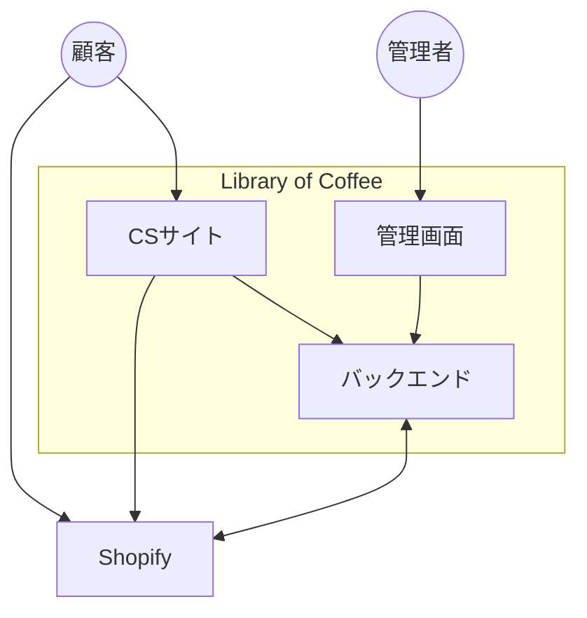

# システム関連図

## 構成要素

| 種別 | 名前 | 説明 |
|------|------|------|
| アクター | 顧客 | 珈琲豆の閲覧・選択を行う利用者 |
| アクター | 管理者 | マスタ・トランザクションデータを管理する運用担当者 |
| 自システム | CSサイト | 顧客向けフロントエンド |
| 自システム | 管理画面 | 管理者向けフロントエンド |
| 自システム | バックエンド | バックエンドAPI |
| 外部システム | Shopify | 顧客・商品・サブスクリプションの情報元 |

## 注釈

- 個人情報やクレジットカード情報などセンシティブなデータはすべてShopifyが管理する。自システムではこれらのデータを保持しない。
