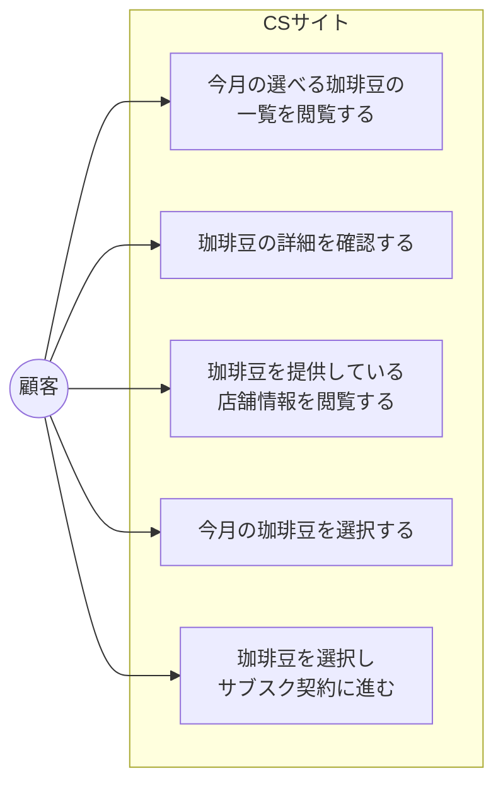
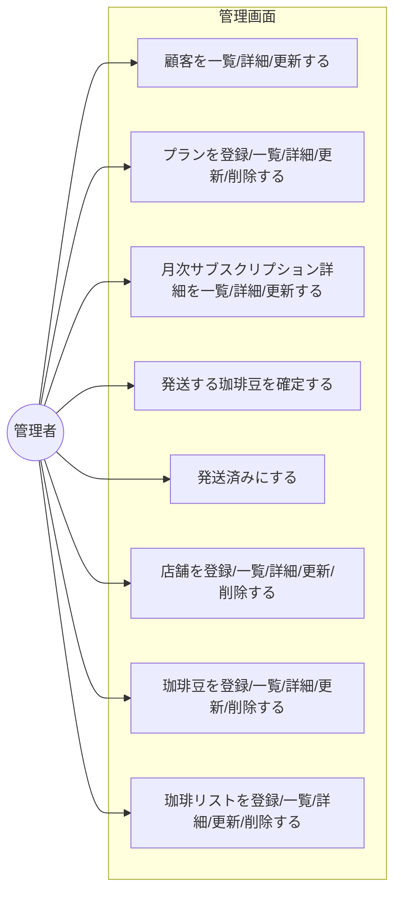

# ユースケース図

## 顧客側ユースケース

## 管理者側ユースケース

## ユースケース一覧

### 顧客側

| # | ユースケース |
|---|------------|
| CS-1 | 今月の選べる珈琲豆の一覧を閲覧する |
| CS-2 | 珈琲豆の詳細を確認する |
| CS-3 | 珈琲豆を提供している店舗情報を閲覧する |
| CS-4 | 今月の珈琲豆を選択する |
| CS-5 | 珈琲豆を選択し、サブスク契約に進む |

### 管理者側

| # | ユースケース |
|---|------------|
| ADM-1 | 顧客を一覧/詳細/更新する |
| ADM-2 | プランを登録/一覧/詳細/更新/削除する |
| ADM-3 | 月次サブスクリプション詳細を一覧/詳細/更新する |
| ADM-4 | 発送する珈琲豆を確定する |
| ADM-5 | 発送済みにする |
| ADM-6 | 店舗を登録/一覧/詳細/更新/削除する |
| ADM-7 | 珈琲豆を登録/一覧/詳細/更新/削除する |
| ADM-8 | 珈琲リストを登録/一覧/詳細/更新/削除する |

## 凡例

| 記号 | 意味 |
|------|------|
| `(("名前"))` | アクター |
| `["名前"]` | ユースケース |
| `subgraph` | システム境界 |
| `-->` | アクターがユースケースを実行する |
